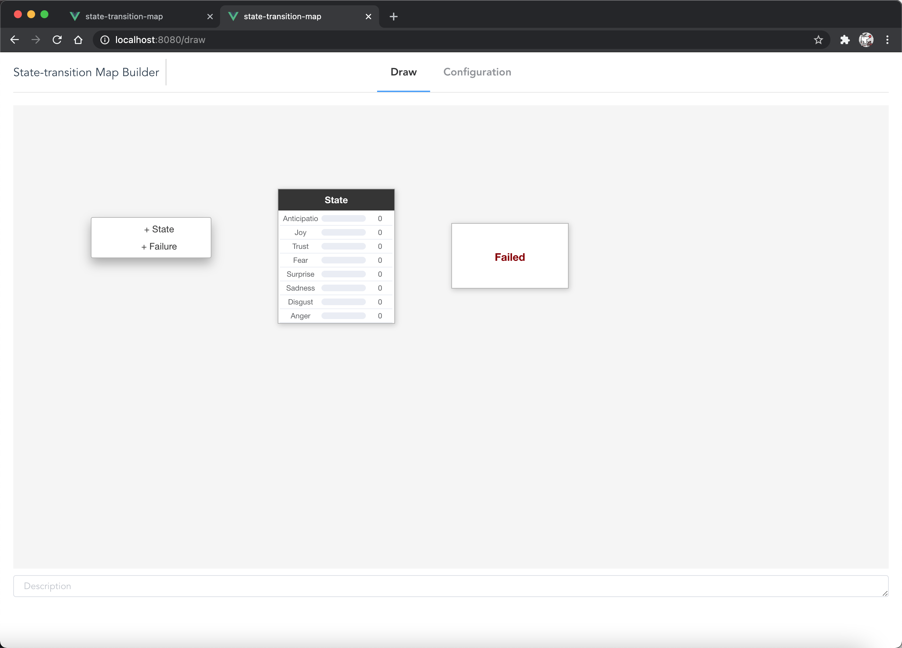
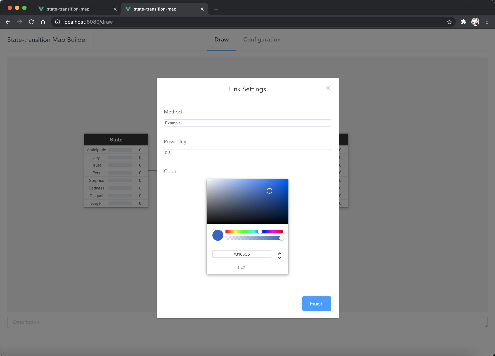
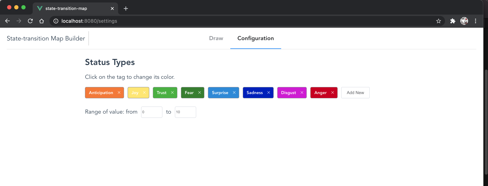
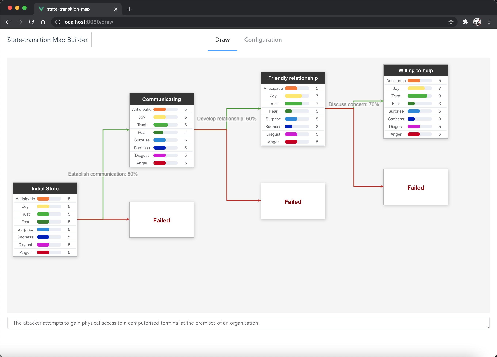

# state-transition-map

## How to use

### State

Right-click on the blank area of page to add a state. Click "+ State" to add a normal state. Click "+ Failure" to add a failed state. 

Click the title of a normal state to change the title. 

Click the number in the right-end of a row in a normal node to change the value of a particular emotion. 

Right-click on the node to remove the node. 



### Description

Input the description in the text area (bottom of the page). 

### Link

Drag from the edge of a node to another to add a link. 

Right-click a link, then select "Edit..." to customize. 

Right-click a link, then select "Remove" to remove. 



### Emotions

Go to "Configuration" tab to customize emotions. 

Some default emotion types have been provided. Titles and color are referred to "Plutchik's wheel of emotions". 



### Done

Finish the graph. 



## Project setup

```
npm install
```

### Compiles and hot-reloads for development
```
npm run serve
```

### Compiles and minifies for production
```
npm run build
```

### Lints and fixes files
```
npm run lint
```

### Customize configuration
See [Configuration Reference](https://cli.vuejs.org/config/).

